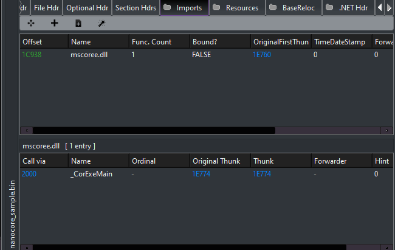
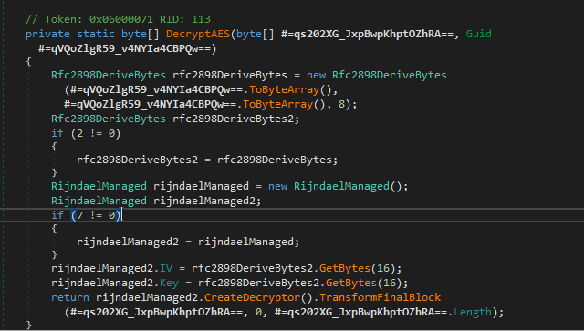
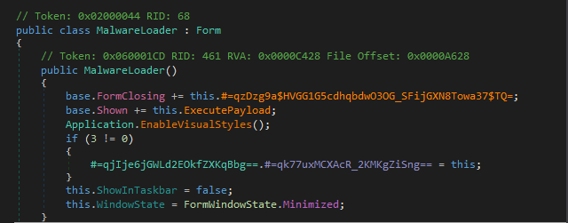
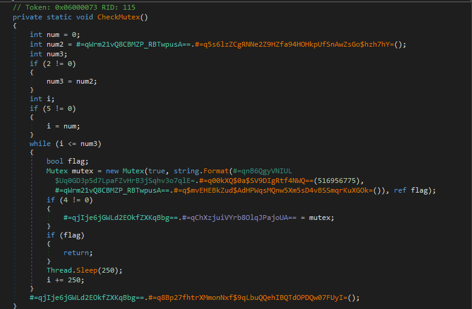
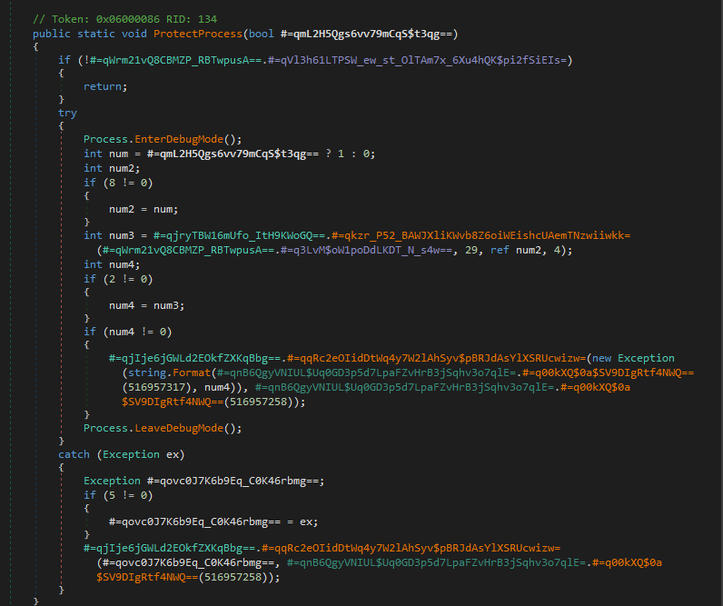
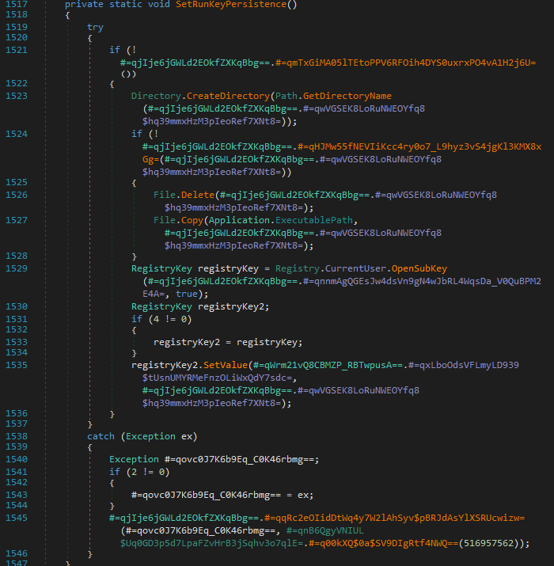
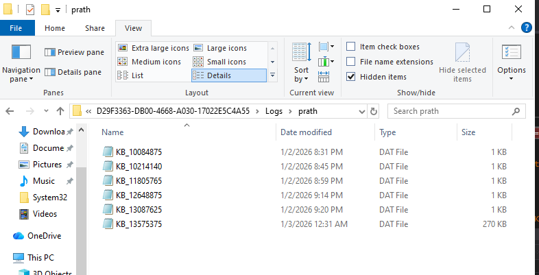

# Analysis of a NanoCore RAT Variant: P/Invoke and Win32 Interop

**TL;DR**
- NanoCore RAT variant targeting Windows 10 (.NET)
- Uses OLE clipboard hijacking instead of `GetClipboardData`
- Implements fileless IPC via memory-mapped sections
- Performs context-aware keylogging with window title correlation

## Introduction

This post documents the reverse engineering of a NanoCore Remote Access Trojan (RAT) variant targeting Windows 10. The analysis focuses on how the malware transitions from its managed .NET runtime into native Windows functionality through extensive use of P/Invoke and COM-based APIs.

Rather than surveying NanoCore functionality at a high level, this write-up concentrates on the initial execution and interoperability layer: the specific Win32 APIs and unmanaged interfaces used to interact with the operating system, establish persistence, and perform surveillance-related tasks.

## Tools Used

- **PE-bear** — Initial triage and PE header inspection  

- **dnSpy** — Used for decompilation, static analysis, and dynamic debugging. Breakpoints were set on entry points and core decryption routines to observe the malware’s runtime state in memory.

- **Process Monitor (Procmon)** — Runtime behavior tracing and artifact correlation to identify file system and registry interactions.

## Sample Metadata

- **Filename:** `nanocore_sample.bin`  
- **SHA-256:** `FF66BE4A8DF7BD09427A53D2983E693489FBE494EDD0244053B29B9F048DF136`  
- **Target Framework:** .NET v2.0 / v3.5  

## Initial Triage and Static Analysis

The investigation began with basic static inspection. Initial triage is essential for determining execution requirements and identifying early indicators of the sample’s lineage and intended behavior.

### PE Header Inspection

Using **PE-bear**, I examined the file structure and header metadata. The sample is a **32-bit Portable Executable (PE)** targeting the **.NET v2.0 / v3.5 Framework**.

This framework choice is common among RAT authors, as it maintains compatibility with older Windows installations and often requires analysts to manually enable legacy components in modern Windows 10/11 environments.

The Import Table is minimal, which is typical for managed assemblies. The most notable import is:

- **`_CorExeMain` (mscoree.dll)**

This function is responsible for initializing the Common Language Runtime (CLR) and transferring execution to the managed .NET entry point.


> *Figure 1: Import table view from PE-bear highlighting CLR initialization.*

---

### Strings Analysis and Behavioral Indicators

A static string dump was performed to extract embedded metadata and runtime indicators. While the output was extensive, several strings immediately stood out due to their relevance to persistence, configuration handling, and runtime behavior.

The following table summarizes notable strings and their inferred purpose:

| Category     | String / Module                  | Potential Purpose                                      |
|-------------|----------------------------------|--------------------------------------------------------|
| Identity    | `NanoCore Client`                | Explicit family identification                         |
| Persistence | `Microsoft.Win32`                | Registry access for auto-start mechanisms              |
| Crypto      | `Rfc2898DeriveBytes`             | Key derivation for encrypted configuration blobs       |
| Stealth     | `SuppressIldasmAttribute`        | Prevents IL disassembly using standard tools           |
| C2 Comms    | `IPEndPoint`, `dnsapi.dll`       | Socket setup and domain resolution                     |
| Privilege   | `EnterDebugMode`                 | Attempt to acquire `SeDebugPrivilege`                  |

The presence of `SuppressIldasmAttribute` suggests an explicit attempt to hinder casual static analysis, while the cryptographic and networking primitives indicate preparation for encrypted configuration handling and remote communication.


## Reverse Engineering the Loader

Inspection of the managed entry point revealed extensive symbol obfuscation, with methods and classes renamed to randomly generated identifiers (e.g., `#=qD4n8L4W9wQX...`). To make further analysis tractable, the first step was systematic symbol renaming in dnSpy to recover the logical structure of the loader.

This process converts otherwise unreadable static noise into a coherent execution flow.

### Symbol Renaming for Clarity

The following renames were applied to the core loader class to reflect observed behavior:

| Original Symbol          | Renamed To        | Rationale                                           |
|--------------------------|-------------------|-----------------------------------------------------|
| `ClientLoaderForm`       | `MalwareLoader`   | Primary GUI-based bootstrap class                   |
| `#=qD4n8L4W9wQX...`      | `ExecutePayload`  | Invoked after environment checks pass               |
| `#=qf3c4WtE$$thN...`     | `DecryptCore`     | Responsible for unpacking the embedded RAT payload  |

These renames allowed the execution path to be followed without repeatedly resolving obfuscated identifiers.

---

### Core Decryption Routine (`DecryptCore`)

The method renamed to `DecryptCore` (originally `#=q8uMGC...`) functions as the primary bootstrap routine.

**Technique.**  
The routine leverages the `Rfc2898DeriveBytes` class to implement a password-based key derivation function (PBKDF2).

**Environmental Keying.**  
To frustrate automated sandboxing, the malware derives its decryption salt from the assembly’s own GUID attribute. This introduces a dependency on intact file metadata—alteration or repackaging can cause decryption to fail.

**Algorithm.**  
The derived key and IV are passed into a `RijndaelManaged` (AES) instance, which decrypts the final payload directly into memory.


*Figure 2: Rijndael (AES) decryption using a key derived from the assembly’s GUID attribute.*

---

### Stealth, Evasion, and Persistence

Additional renamed methods reveal several techniques intended to evade analysis and maintain persistence.

#### Execution Hook and Initialization

During initialization, the loader ensures the GUI remains invisible by setting `ShowInTaskbar = false` and `WindowState = Minimized`. Execution is deferred by hooking the `base.Shown` event, which triggers payload execution only after the form lifecycle completes.

This design bypasses simple sandbox environments that do not emulate GUI events.


*Figure 3: Deferred execution via the `Shown` event.*

---

#### Mutex-Based Single-Instance Check (`CheckMutex`)

A GUID-derived mutex (originally `#=qBpzeg...`) is used to enforce single-instance execution. If the mutex already exists, the process terminates.

This behavior also allows defenders or analysts to preemptively block execution by creating the mutex prior to launch.


*Figure 4: Mutex-based execution guard.*

---

#### Persistence and Process Protection

### Process Protection (`ProtectProcess`)

The method responsible for process protection attempts to harden the malware against userland interference. Execution begins by invoking `Process.EnterDebugMode()`, which requests the `SeDebugPrivilege`. This privilege allows the process to inspect and interact with other processes on the system, including those owned by the SYSTEM account.

Following privilege escalation, the routine issues a native call via an obfuscated wrapper into `ntdll`, passing a process information class value of `29`. This value corresponds to `ProcessBreakOnTermination`, a flag that alters how the operating system responds to process termination.

When set, this flag may cause Windows to treat the process as critical, such that terminating it can trigger a system bugcheck (BSOD) on certain Windows versions and configurations. While not universally enforced, this behavior introduces significant friction for analysts and defenders attempting to kill the process using standard utilities.

This technique effectively discourages termination by coupling malware removal with system instability.


*Figure 5: Process protection routine requesting `SeDebugPrivilege` and issuing native calls to modify termination behavior.*

### Registry Persistence (`SetRunKeyPersistence`)

Persistence is established through a registry-based mechanism. The malware copies itself to a configured location within the user profile—observed during dynamic analysis as `AppData\Roaming\dft-ddsf--\`—and registers an autorun entry under the following key:
`HKCU\Software\Microsoft\Windows\CurrentVersion\Run`

This approach avoids the need for administrative privileges and ensures execution upon each user login. The use of per-user persistence combined with non-descriptive directory naming allows the malware to survive reboots and basic cleanup attempts without triggering User Account Control (UAC).


*Figure 6: Registry-based persistence via the current user’s `Run` key.*

## Covert Interception Techniques Across Windows Subsystems

## 1. OLE-Based Clipboard Hijacking

### Overview

A common indicator of clipboard theft is the use of `user32.dll!GetClipboardData`. This NanoCore variant, however, employs a more advanced approach by interacting with the Windows clipboard through the Component Object Model (COM) subsystem exposed by `ole32.dll`.

Rather than polling high-level User32 APIs, the malware treats the clipboard as a COM object and interfaces with it using OLE functions.

---

### Technical Analysis

The loader initializes the COM library and invokes `OleGetClipboard`, retrieving a pointer to an `IDataObject` interface representing the current clipboard contents.

This approach provides greater flexibility than traditional clipboard scraping. Instead of extracting a single text buffer, the malware can query the clipboard for multiple registered data formats, including:

- **`CF_UNICODETEXT`** — Used to capture copied passwords and sensitive strings  
- **`CF_HDROP`** — Used to identify files copied via File Explorer, enabling potential file exfiltration  

By operating on the `IDataObject` interface, the RAT gains access to structured clipboard contents rather than raw strings alone.

---

### Persistence via Clipboard Flushing

A notable aspect of this implementation is the use of `OleFlushClipboard`.

Under normal circumstances, clipboard data owned by an application is released when that application exits. By calling `OleFlushClipboard`, the malware forces Windows to render and persist the clipboard contents into a global memory object.

This behavior ensures that captured data remains accessible even if the originating application such as a password manager terminates or attempts to clear the clipboard. The flushed data can then be harvested asynchronously and written to the malware’s internal log files.

This technique increases the reliability of clipboard harvesting and reduces the likelihood of data loss due to user interaction.

---

### Relevant Native Imports

```csharp
// Native imports for OLE-based clipboard hijacking
[DllImport("ole32.dll", CharSet = CharSet.Auto, ExactSpelling = true)]
public static extern int OleGetClipboard(ref IDataObject data);

[DllImport("ole32.dll", CharSet = CharSet.Auto, ExactSpelling = true)]
public static extern int OleSetClipboard(IDataObject pDataObj);

[DllImport("ole32.dll", CharSet = CharSet.Auto, ExactSpelling = true)]
public static extern int OleFlushClipboard();
```

---

### 2. Global Keyboard Hooking (`SetWindowsHookEx`)

This module functions as a primary surveillance mechanism by installing a global keyboard hook. Once active, the malware is able to observe keystroke activity across all user applications.

---

### Technical Analysis

The malware installs the hook using the `SetWindowsHookEx` API. While this function is commonly used for accessibility or UI-related features, the implementation detail of interest is the `idHook` parameter.

In this case, the value passed is `13`, corresponding to `WH_KEYBOARD_LL` (low-level keyboard hook).

Unlike thread-specific hooks, `WH_KEYBOARD_LL` receives keyboard input events before they are dispatched to the target application. This allows the malware to intercept keystrokes globally, independent of which window or process currently has focus.

Because the hook procedure executes in the context of the malware’s own process, Windows must invoke the callback for every keyboard event, enabling continuous observation of user input with minimal visibility to the user.

---

### Implementation Detail

```csharp
public static HandleRef SetWindowsHookEx(
    UnsafeNativeMethods.HookType idHook,
    UnsafeNativeMethods.HookProc lpfn,
    IntPtr hMod,
    int dwThreadId)
{
    // idHook value 13 corresponds to WH_KEYBOARD_LL
    IntPtr hookHandle = UnsafeNativeMethods.IntSetWindowsHookEx(
        idHook, lpfn, hMod, dwThreadId);

    if (hookHandle == IntPtr.Zero)
    {
        throw new Win32Exception();
    }

    return new HandleRef(lpfn, hookHandle);
}
```
---

### Forensic Evidence: Context-Aware Keystroke Logging
Evidence of the global hook’s effectiveness is present in the encrypted .dat log files written to the malware’s working directory under the user’s AppData path.

Analysis of decrypted log data shows that the malware does not merely record raw keystrokes. Each keystroke is correlated with the active window title at the time of capture, enabling contextual reconstruction of user activity.

Captured entries included commands executed in Command Prompt, navigation within dnSpy, and file operations performed in Visual Studio Code, allowing an attacker to reconstruct user workflows rather than isolated input events.


*Figure 7: Encrypted keystroke log artifacts located in the AppData directory.*

### Decrypted Keystroke Log Excerpt
```
 ø8Xi#[dnSpy] dnSpy v6.1.8 (32-bit, .NET)t.[dnSpy] dnSpy v6.1.8 (32-bit, .NET, Debugging)tttttttttttttttt[SearchApp] Searchprocessjahackersystem informer

 Q9Xi#[dnSpy] dnSpy v6.1.8 (32-bit, .NET)>reg query "HKCU\Software\Microsoft\Windows\CurrentVersion\Run"[cmd] Command Promptcls



reg query "HKCU\Software\"

md] Select Command Promptª C:\Users\prath\Desktop\malware\ff66be4a8df7bd09427a53d2983e693489fbe494edd0244053b29b9f048df136>reg query "HKCU\Software\Microsoft\Windows\CurrentVersion\Run"


HKEY_CURRENT_USER\Software\Microsoft\Windows\CurrentVersion\Run

    OneDrive    REG_SZ    "C:\Users\prath\AppData\Local\Microsoft\OneDrive\OneDrive.exe" /background

    Microsoft Edge Update    REG_SZ    "C:\Users\prath\AppData\Local\Microsoft\EdgeUpdate\1.3.215.9\MicrosoftEdgeUpdateCore.exe"

    MicrosoftEdgeAutoLaunch_4DFB861AB890CDB368AD8B03A369AA8A    REG_SZ    "C:\Program Files (x86)\Microsoft\Edge\Application\msedge.exe" --no-startup-window --win-session-start


C:\Users\prath\Desktop\malware\ff66be4a8df7bd09427a53d2983e693489fbe494edd0244053b29b9f048df136>reg query "HKCU\Software\"

ERROR: The system was unable to find the specified registry key or value.


C:\Users\prath\Desktop\malware\ff66be4a8df7bd09427a53d2983e693489fbe494edd0244053b29b9f048df136>[cmd] Command Prompt#reg query "HKCU\Software" /f "*" /k

 «9Ximd] Select Command Prompt [cmd] Command Prompt!reg query "HKCU" /f "dft-ddsf" /s



 X:Xi#[dnSpy] dnSpy v6.1.8 (32-bit, .NET)x ¡?Xi'[Code] Logfile.CSV - Visual Studio CodeÅÙ"8:31:24.8395441 PM","nanocore_sample.bin","9456","RegSetInfoKey","HKLM\System\CurrentControlSet\Control\Session Manager","SUCCESS","KeySetInformationClass: KeySetHandleTagsInformation, Length: 0"

"8:31:24.8395513 PM","nanocore_sample.bin","9456","RegQueryValue","HKLM\System\CurrentControlSet\Control\Session Manager\SafeDllSearchMode","NAME NOT FOUND","Length: 16"

"8:31:24.8398040 PM","nanocore_sample.bin","9456","CreateFile","C:\Windows\Microsoft.NET\Framework\v2.0.50727\mscorwks.dll","SUCCESS","Desired Access: Read Attributes, Disposition: Open, Options: Open Reparse Point, Attributes: n/a, ShareMode: Read, Write, Delete, AllocationSize: n/a, OpenResult: Opened"

"8:31:24.8398448 PM","nanocore_sample.bin","9456","QueryBasicInformationFile","C:\Windows\Microsoft.NET\Framework\v2.0.50727\mscorwks.dll","SUCCESS","CreationTime: 7/16/2025 7:01:58 PM, LastAccessTime: 1/2/2026 8:28:49 PM, LastWriteTime: 7/11/2024 9:37:20 PM, ChangeTime: 1/2/2026 8:28:49 PM, FileAttributes: A"

"8:31:24.8398533 PM","nanocore_sample.bin","9456","CloseFile","C:\Windows\Microsoft.NET\Framework\v2.0.50727\mscorwks.dll","SUCCESS",""

"8:31:24.8399881 PM","nanocore_sample.bin","9456","CreateFile","C:\Windows\Microsoft.NET\Framework\v2.0.50727\mscorwks.dll","SUCCESS","Desired Access: Generic Read, Disposition: Open, Options: Synchronous IO Non-Alert, Non-Directory File, Attributes: n/a, ShareMode: Read, Delete, AllocationSize: n/a, OpenResult: Opened"

"8:31:24.8402810 PM","nanocore_sample.bin","9456","QueryEAFile","C:\Windows\Microsoft.NET\Framework\v2.0.50727\mscorwks.dll","SUCCESS",""

"8:31:24.8403081 PM","nanocore_sample.bin","9456","FileSystemControl","C:\Windows\Microsoft.NET\Framework\v2.0.50727\mscorwks.dll","INVALID DEVICE REQUEST","Control: FSCTL_GET_EXTERNAL_BACKING"

"8:31:24.8403333 PM","nanocore_sample.bin","9456","FileSystemControl","C:\Windows\Microsoft.NET\Framework\v2.0.50727\mscorwks.dll","SUCCESS","Control: FSCTL_QUERY_USN_JOURNAL"

"8:31:24.8410076 PM","nanocore_sample.bin","9456","CreateFileMapping","C:\Windows\Microsoft.NET\Framework\v2.0.50727\mscorwks.dll","FILE LOCKED WITH ONLY READERS","SyncType: SyncTypeCreateSection, PageProtection: PAGE_EXECUTE_WRITECOPY|PAGE_NOCACHE"

"8:31:24.8410304 PM","nanocore_sample.bin","9456","QueryStandardInformationFile","C:\Windows\Microsoft.NET\Framework\v2.0.50727\mscorwks.dll","SUCCESS","AllocationSize: 6,418,432, EndOfFile: 6,414,784, NumberOfLinks: 2, DeletePending: False, Directory: False"

"8:31:24.8410424 PM","nanocore_sample.bin","9456","ReadFile","C:\Windows\Microsoft.NET\Framework\v2.0.50727\mscorwks.dll","SUCCESS","Offset: 0, Length: 4,096, I/O Flags: Non-cached, Paging I/O, Synchronous Paging I/O, Priority: Normal"

"8:31:24.8427973 PM","nanocore_sample.bin","9456","ReadFile","C:\Windows\Microsoft.NET\Framework\v2.0.50727\mscorwks.dll","SUCCESS","Offset: 6,050,816, Length: 32,256, I/O Flags: Non-cached, Paging I/O, Synchronous Paging I/O, Priority: Normal"

"8:31:24.8441670 PM","nanocore_sample.bin","9456","ReadFile","C:\Windows\Microsoft.NET\Framework\v2.0.50727\mscorwks.dll","SUCCESS","Offset: 513,024, Length: 32,768, I/O Flags: Non-cached, Paging I/O, Synchronous Paging I/O, Priority: Normal"

"8:31:24.8465385 PM","nanocore_sample.bin","9456","ReadFile","C:\Windows\Microsoft.NET\Framework\v2.0.50727\mscorwks.dll","SUCCESS","Offset: 6,144,000, Length: 16,384, I/O Flags: Non-cached, Paging I/O, Synchronous Paging I/O, Priority: Normal"

"8:31:24.8472477 PM","nanocore_sample.bin","9456","ReadFile","C:\Windows\Microsoft.NET\Framework\v2.0.50727\mscorwks.dll","SUCCESS","Offset: 6,160,384, Length: 16,384, I/O Flags: Non-cached, Paging I/O, Synchronous Paging I/O, Priority: Normal"

"8:31:24.8480436 PM","nanocore_sample.bin","9456","ReadFile","C:\Windows\Microsoft.NET\Framework\v2.0.50727\mscorwks.dll","SUCCESS","Offset: 6,176,768, Length: 16,384, I/O Flags: Non-cached, Paging I/O, Synchronous Paging I/O, Priority: Normal"
```

### 3. GDI-Based Screen Capture (`BitBlt`)

This component implements visual surveillance by capturing the contents of the user’s desktop using the Windows Graphics Device Interface (GDI). Rather than interacting with higher-level screen capture APIs, the malware operates directly on device contexts to extract pixel data without visible artifacts.

---

### Technical Analysis

Screen capture is performed by treating the display as a device-backed drawing surface. The malware first calls `GetDC` to obtain a handle to the device context associated with the primary display. It then invokes `CreateCompatibleDC` to create a memory-backed device context that exists entirely in RAM and is not visible to the user.

A compatible bitmap is allocated and selected into this memory context, providing a destination buffer for pixel data.

The transfer itself is performed using the `BitBlt` (Bit Block Transfer) API. The malware specifies the raster operation value `SRCCOPY` (`0x00CC0020`), instructing Windows to perform a direct, bit-for-bit copy of pixel data from the screen’s device context into the hidden memory buffer.

By repeatedly invoking this sequence in a timed loop, the malware is able to capture successive snapshots of the desktop. When performed at short intervals, this approach allows the attacker to reconstruct user activity visually without relying on explicit screen recording APIs.

---

### Implementation Detail

```csharp
[DllImport("gdi32.dll", CharSet = CharSet.Auto, ExactSpelling = true, SetLastError = true)]
public static extern bool BitBlt(
    HandleRef hDC,
    int x,
    int y,
    int nWidth,
    int nHeight,
    HandleRef hSrcDC,
    int xSrc,
    int ySrc,
    int dwRop);

[DllImport("gdi32.dll", CharSet = CharSet.Auto, ExactSpelling = true, SetLastError = true)]
public static extern IntPtr CreateCompatibleBitmap(
    HandleRef hDC,
    int width,
    int height);
```
---

### 4. Fileless IPC via Memory Mapping (`CreateFileMapping`)

This section documents one of the more subtle evasion techniques observed in the sample. During behavioral analysis, the RAT appeared to interact with a file named `rpcss.dll`. However, no corresponding file was present on disk. Further investigation revealed that this behavior was the result of abusing Windows section objects rather than interacting with a physical DLL.

---

### Technical Analysis

The malware creates a named memory section using the `CreateFileMapping` API, passing a file handle value of `-1` (`INVALID_HANDLE_VALUE`).

In the Windows API, specifying `INVALID_HANDLE_VALUE` instructs the operating system to back the mapping with the system paging file instead of an on-disk file. The result is a memory-backed section object that exists entirely in RAM and has no persistent representation on the filesystem.

Because the section object is named, it can be referenced by other components using `OpenFileMapping`, allowing multiple processes to map views of the same shared memory region.

---

### Fileless Inter-Process Communication

This memory-backed section functions as a covert inter-process communication (IPC) channel. Other malicious components can attach to the section using `OpenFileMapping` and `MapViewOfFileEx`, enabling data exchange without creating temporary files or observable artifacts on disk.

This mechanism enables the RAT to:

- **Transfer captured data** — such as keystrokes or clipboard contents — between processes without writing intermediate files to the NTFS volume.
- **Share runtime state** — allowing injected modules or plugins to synchronize execution through shared memory.

---

### Executable Memory Mapping

In addition to data exchange, the mapping is created with permissive memory protection flags. By specifying `PAGE_EXECUTE_READWRITE` (`0x40`), the malware creates a region that is writable and executable.

This allows dynamically generated code stubs to be written directly into the shared section and executed by mapped processes, supporting fileless code execution without dropping additional binaries to disk.

---

### Implementation Detail

```csharp
[DllImport("kernel32.dll", SetLastError = true)]
internal static extern UnsafeNativeMethods.SafeFileMappingHandle CreateFileMapping(
    SafeFileHandle hFile,
    NativeMethods.SECURITY_ATTRIBUTES lpFileMappingAttributes,
    int flProtect,
    uint dwMaximumSizeHigh,
    uint dwMaximumSizeLow,
    string lpName);

[DllImport("kernel32.dll", SetLastError = true)]
internal static extern UnsafeNativeMethods.SafeViewOfFileHandle MapViewOfFileEx(
    UnsafeNativeMethods.SafeFileMappingHandle hFileMappingObject,
    int dwDesiredAccess,
    int dwFileOffsetHigh,
    int dwFileOffsetLow,
    IntPtr dwNumberOfBytesToMap,
    IntPtr lpBaseAddress);
```
---

### Design Note: Hook Chain Preservation (`CallNextHookEx`)

While `SetWindowsHookEx` enables interception of user input, correct handling of the hook chain is what allows the malware to remain operational and unobtrusive.

In the Windows input architecture, hooks are organized into a chain. Each registered hook procedure is expected to process the event and then explicitly pass it onward. After recording a keystroke or input event, the malware invokes `CallNextHookEx` to forward execution to the next hook or to the target application.

---

### Technical Rationale

By calling `CallNextHookEx`, the malware signals that it has completed its processing and that normal input dispatch should continue. Failure to forward events would stall the input pipeline, causing keyboard and mouse interaction to become unresponsive and immediately alerting the user.

This design choice highlights the parasitic nature of the implementation: the RAT embeds itself within the normal input flow, siphoning data while preserving expected system behavior. Rather than disrupting execution, it prioritizes transparency to avoid triggering user suspicion.

---

### Implementation Detail

```csharp
[DllImport("user32.dll", SetLastError = true)]
public static extern IntPtr CallNextHookEx(
    HandleRef hhk,
    int nCode,
    IntPtr wParam,
    IntPtr lParam);
```
---

## Conclusion
Analysis of this NanoCore variant reveals a deliberately engineered interoperability layer that bridges managed .NET code with native Windows subsystems. Rather than relying on a single capability, the malware assembles a surveillance pipeline by operating across multiple abstraction layers of the operating system.

The techniques observed emphasize reliability, coverage, and stealth over overt exploitation. By integrating with standard Windows mechanisms—clipboard handling, input dispatch, graphics rendering, and shared memory—the RAT is able to observe user activity while minimizing disruption and forensic artifacts.

The following table summarizes the primary behavioral techniques identified during analysis:

| Technique | Primary API | Objective |
|---------|-------------|-----------|
| OLE Clipboard Hijacking | `OleGetClipboard` | Extracts structured clipboard data via COM |
| Global Keyboard Hooking | `SetWindowsHookEx` | Intercepts keystrokes before application delivery |
| GDI Screen Capture | `BitBlt` | Captures desktop pixel data for visual monitoring |
| Fileless IPC | `CreateFileMapping` | Enables shared memory communication without disk artifacts |

This analysis highlights the continued effectiveness of living-off-the-library techniques, where native Windows components are repurposed to support surveillance while avoiding obvious indicators.

Further analysis will examine persistence and obfuscation techniques in a macOS-based spyware sample.


